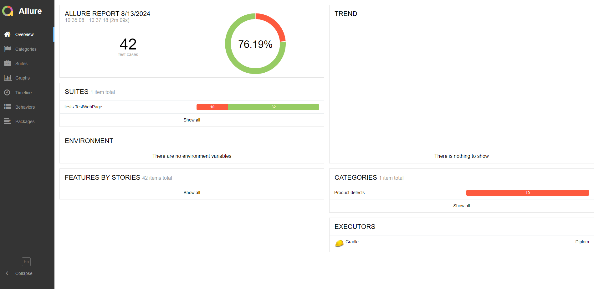

# **Отчёт об автоматизации**

**Проведено тестирование веб-сервиса по покупке тура. Все тестовые сценарии автоматизированы. Проверены два варианта оплаты:**
* по дебетовой карте (Купить)
* по кредитной карте (Купить в кредит)

**Автоматизированные тесты были успешно запущены для двух СУБД:**
* MySQL
* PostgreSQL

Всего составлено 42 теста, из них:
* Успешных - 32 (76.19%)
* Неуспешных -10 (23.8%)

# **Заключение**
В ходе автоматизации были успешно созданы автотесты для проверки заполнения полей веб-формы и взаимодействия с базами данных MySQL и PostgreSQL. Несмотря на возникшие трудности, автоматизация значительно повысила эффективность тестирования и улучшила качество продукта.